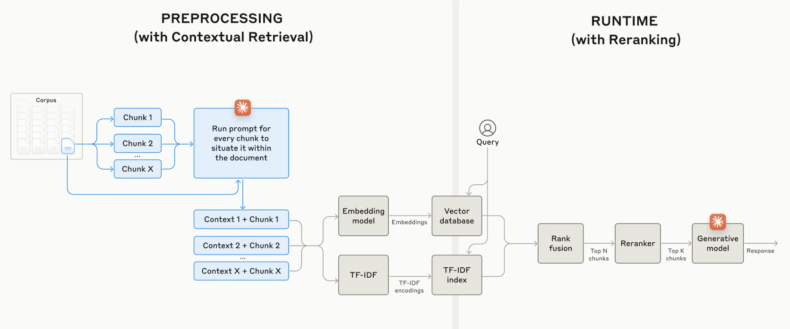

# Contextual Retrieval Augmented Generation Example


## Build with

The project uses:
* [Python](https://www.python.org/)
* [LangChain](https://www.langchain.com/)
* [Okapi BM25](https://fr.wikipedia.org/wiki/Okapi_BM25)
* [FAISS](https://github.com/facebookresearch/faiss)
* [Openai API](https://platform.openai.com/)
* [Anthropic API](https://console.anthropic.com/)
* [GoogleGenerativeAI API](https://aistudio.google.com/)
* [MLFlow Tracking](https://mlflow.org/docs/latest/tracking/)


## Architecture

[https://www.anthropic.com/news/contextual-retrieval](https://www.anthropic.com/news/contextual-retrieval)

## Setup

### Prerequisites
- Python 3.8+
- pip (Python package manager)


### Installation

1. Clone this repository:
```bash
git clone https://github.com/Wizo17/contextual_rag_application.git
cd contextual_rag_application
```

2. Create a virtual environment:
```bash
python -m venv venv
```

3. Activate the virtual environment:
```bash
# Unix / MacOS
source venv/bin/activate
# Windows
venv\Scripts\activate
```

4. Install dependencies:
```bash
pip install -r requirements.txt
```
<em>If you have some issues, use python 3.12.0 and requirements_all.txt</em>


5. Create .env file:
```bash
cp .env.example .env
```

6. **Update .env file**


## Running app

#### Keep or Delete and import **your own document in data/raw**

#### Start mlflow if MLFLOW_ENABLE = "yes"
Adapt host (MFFLOW_HOST) and port (MFFLOW_PORT)
```bash
mlflow server --host 127.0.0.1 --port 5000
```

#### Build index first
It is not necessary if you keep my docs and my indexes
Remove all files in data/index before
```bash
python main.py
```

#### Test application
Update queries if you don't keep my docs and my indexes
```bash
python test.py
```

By launching streamlit, you can have competitive conflicts with `torch`. It is not a problem for this version.
```bash
streamlit run chatbot.py
```


## Authors

* [@wizo17](https://github.com/Wizo17)

## License

This project is licensed under the ``MIT`` License - see [LICENSE](LICENSE.md) for more information.
